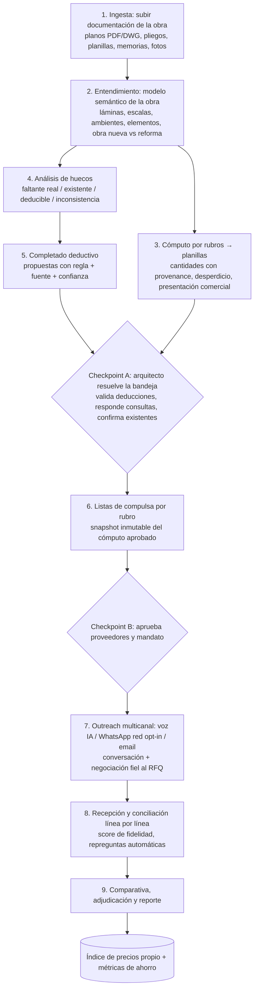

# COMPULSA v2 — Plataforma de análisis documental, cómputo y compulsa de obra

> **Especificación funcional y de desarrollo · v2.0 · Agosto 2026**
> Reemplaza a v0.1 (cotizador WhatsApp-first) como documento rector. Incorpora las correcciones del arquitecto: interfaz web/app dedicada, cómputo multi-rubro desde documentación completa, análisis de lo mostrado vs. lo no mostrado, completado deductivo de planos, y fidelidad absoluta cómputo → presupuesto.

---

## 0. Qué cambió respecto de v0.1

| Tema | v0.1 | v2.0 |
|---|---|---|
| Interfaz principal | WhatsApp | **Workspace web** (Next.js). WhatsApp queda como canal de notificaciones y de outreach a proveedores |
| Alcance del cómputo | Un pedido puntual (una ventana) | **La obra completa**: expediente documental → cómputo por rubros → planillas |
| Análisis de planos | Extraer specs del ítem | Entender la totalidad: **qué se muestra, qué falta, qué es existente** (reforma), qué se puede deducir |
| Capacidad nueva | — | **Completado deductivo**: derivar la información que el plano no muestra, sin inventar, con validación del arquitecto |
| Principio rector | Velocidad de cotización | **Fidelidad y exactitud**: trazabilidad total documento → cómputo → RFQ → presupuesto, cero faltantes de material |

El pipeline de compulsa de v0.1 (sourcing, outreach multicanal, negociación con mandato, compliance WhatsApp, índice de precios) **sigue vigente** y se integra como etapa final; acá se resume y se referencia.

---

## 1. Visión y objetivo económico

**Una plataforma donde el arquitecto sube la documentación de una obra y recibe: el cómputo por rubros en planillas, la lista de todo lo que la documentación no resuelve (clasificado en faltante real / existente / deducible), la documentación derivada que completa esos huecos por deducción validada, y las compulsas de precios ya lanzadas, negociadas y comparadas con fidelidad línea por línea.**

De dónde salen los "muchos millones" (tesis de ahorro, a validar con datos propios):

1. **Errores y huecos de documentación** son la principal fuente de sobrecostos: los problemas de diseño afectan al 44,8% de los proyectos, y el ciclo de RFIs consume en promedio miles de horas por proyecto con ~10 días de impacto de cronograma por consulta (datos de la industria vía Firmus/Navigant). Detectarlos **antes** de comprar y construir es la palanca más grande.
2. **Faltantes de material en obra** = compras de urgencia a sobreprecio + días de obra parada. Se atacan con cómputo exacto + coeficientes de desperdicio + redondeo a presentación comercial.
3. **Dispersión de precios** entre proveedores del mismo ítem: la compulsa sistemática captura la diferencia entre el mejor y el peor oferente en cada rubro.
4. **Negociación**: benchmark realista de 1–7% adicional (Pactum, a escala enterprise).
5. **Horas profesionales**: computar y compulsar una obra hoy lleva días/semanas de trabajo senior; la plataforma lo baja a horas de revisión.

Sobre una cartera anual de obras de USD 2–5M, una mejora combinada del 5–10% del costo son **USD 100–500k/año**. En pesos: los millones del título. El tablero de la plataforma debe **medir y mostrar este ahorro** (ver §17) para que la tesis se demuestre sola.

---

## 2. Principios de diseño (derivados del feedback del arquitecto)

- **P1 — Fidelidad documental.** Nada se cotiza que no salga de la documentación; nada de la documentación queda sin computar. Cada número tiene trazabilidad hasta la lámina y coordenada de origen. La cadena documento → entidad → ítem de cómputo → línea de RFQ → línea de presupuesto → comparativa es íntegra y auditable.
- **P2 — Exactitud para construir.** El objetivo del cómputo no es "estimar": es poder ejecutar la obra sin faltantes ni sobrantes. Cantidad neta + desperdicio + redondeo comercial, verificación cruzada, doble pasada.
- **P3 — Mostrado vs. no mostrado.** El sistema modela explícitamente qué información contiene cada lámina y qué información *debería* contener según el tipo de obra y rubro. Todo hueco se clasifica; ninguno se ignora ni se rellena en silencio.
- **P4 — Deducir, no inventar.** Un dato ausente solo se completa si puede derivarse de otras partes de la documentación o de normas/estándares explícitos, siempre con fuente, regla, confianza y **validación del arquitecto** antes de usarse. Lo que no se puede deducir es una consulta, no un supuesto silencioso.
- **P5 — Contexto de obra completa.** El análisis nunca es lámina por lámina aislada: se construye un modelo semántico de toda la obra (ambientes, niveles, elementos, relaciones entre láminas) y de su naturaleza (obra nueva / reforma / ampliación), porque solo con la totalidad se distingue "falta" de "ya existe".
- **P6 — Interfaz adecuada a la herramienta.** Planillas se revisan en una grilla, planos en un visor, deducciones sobre el plano, conversaciones en hilos. El humano aprueba en checkpoints; los agentes ejecutan (patrón "you approve, it executes").

---

## 3. Flujo de trabajo completo



---

## 4. Estado del arte relevante (investigación agosto 2026)

**Para las capacidades nuevas de v2:**

- **Detección de faltantes e inconsistencias — Firmus AI** (adquirida por Bluebeam/Nemetschek, sept. 2025): sus productos AI-REVIEW y AI-MATCH leen sets de planos PDF 2D y detectan información faltante, huecos de alcance e inconsistencias entre disciplinas, escalas y revisiones, entregando reportes visuales con issues priorizados. Casos: verificación de continuidad (que una cañería tenga el mismo diámetro al entrar y dentro del edificio), comparación planta-corte, tags vs. planillas. **Valida que el "análisis de lo no mostrado" es viable y valioso; nuestro diferencial es hacerlo en español, con lógica de reforma argentina (amarillo/rojo) y conectado al cómputo y la compulsa, no solo al reporte.**
- **Generación/completado de documentación — Swapp**: genera documentación de obra (CDs) desde el diseño esquemático dentro de Revit/ArchiCAD, aprendiendo los estándares del estudio; automatiza hasta ~80% de las tareas de documentación (cotas, tags, vistas, planillas) con patrón agéntico "vos aprobás, el agente ejecuta". **Valida el "completar lo que falta" como producto; nuestro alcance F1 es más acotado (anotaciones, planillas derivadas y memoria de deducciones sobre PDF, no edición BIM) y por eso alcanzable.**
- **Takeoff multi-rubro**: BuildVision, Kamai, Togal, MeasureSquare extraen cantidades de planos por gremio; Beam AI usa modelo híbrido IA + QA humano (24–72 h) — la lección sigue siendo que el checkpoint humano es parte del diseño.

**Heredado de v0.1 (resumen):** negociación autónoma validada por Pactum (1–7% de mejora, mandato + guardrails + trazabilidad total); voz IA para llamadas a gremios a US$0,11–0,33/min all-in (Retell/Vapi); WhatsApp API exige opt-in para mensajes iniciados por el negocio (el contacto frío va por voz/email; la red opt-in de proveedores es el activo); mercado AR con hueco claro (Habitissimo cerró ~2024, Nuqlea solo materiales/fabricantes y web-first, HomeSolution B2C hogar). Fuentes al final.

**Ninguna herramienta del mercado une las cuatro cosas: entender la documentación completa, computarla con fidelidad, completar lo que falta por deducción, y salir a compulsar y negociar.** Ese es el producto.

---

## 5. Módulos del sistema

- **M1 · Expediente de obra.** Repositorio documental por obra: planos (PDF, DWG/DXF, imágenes), pliegos, memorias, planillas, fotos de relevamiento. Versionado por lámina, detección de revisiones, lectura de carátulas/rótulos (escala, fecha, revisión, disciplina), clasificación automática de láminas (plantas, cortes, vistas, detalles, estructura, instalaciones). Q&A conversacional sobre el expediente ("¿qué dice el pliego sobre la carpintería C3?").
- **M2 · Entendimiento de obra.** Construye el **modelo semántico**: niveles, ambientes, elementos (muros, aberturas, instalaciones, terminaciones) con geometría aproximada y atributos, relaciones entre láminas (el corte A-A referenciado en la planta, la carpintería V2 de la planilla ubicada en el plano). Detecta tipo de obra (nueva / reforma / ampliación) — en reformas interpreta la convención **amarillo/rojo** (a demoler en amarillo, obra nueva en rojo, existente en negro) para separar lo que se computa de lo que ya está construido. Genera un resumen ejecutivo de la obra.
- **M3 · Cómputo por rubros.** Sobre el modelo semántico, computa cantidades por rubro y las baja a **planillas editables** (grilla tipo hoja de cálculo). Cada ítem: descripción, unidad, cantidad neta, % desperdicio (configurable por material), **cantidad de compra redondeada a presentación comercial** (pallet, lata, barra, m² de placa), origen (explícito / deducido / supuesto), fuentes (lámina + coordenadas), confianza. Doble pasada de verificación y diff. Recomputo incremental cuando llega una revisión de plano, con diff de cantidades. Export XLSX/CSV.
- **M4 · Análisis de huecos ("lo no mostrado").** Contra un **checklist de completitud por rubro y tipo de obra** ("para cotizar aberturas necesito: medidas de vano, tipología, línea, vidrio, color, premarco…"; "para instalación sanitaria: recorridos, diámetros, pendientes, artefactos…"), detecta y clasifica cada hueco (taxonomía en §12). Detecta además **inconsistencias**: cota de planta ≠ corte, tag sin entrada en planilla, cañería que no continúa entre niveles, sumatoria de parciales ≠ total.
- **M5 · Completado deductivo.** Para los huecos deducibles, genera propuestas con regla, fuentes y confianza; las presenta como **capas de anotación sobre el visor** (cotas deducidas, notas, marcas) + **planillas derivadas** (p. ej. planilla de carpinterías reconstruida desde plantas y cortes) + **memoria de deducciones** exportable. Nunca modifica el archivo original: todo es capa versionada. Nada deducido entra al cómputo sin validación (Checkpoint A).
- **M6 · Bandeja de consultas.** El inbox del arquitecto: cada hallazgo (faltante, supuesto, existente a confirmar, inconsistencia) como tarjeta con acciones de un click: *Responder* (aporta el dato) / *Es existente* / *Confirmar supuesto* / *Corregir documentación* / *Descartar*. Es el RFI interno que reemplaza los mails de ida y vuelta.
- **M7 · Compulsa (RFQ).** Desde el cómputo aprobado arma paquetes de cotización por rubro: **snapshot inmutable con hash** (si el cómputo cambia, la compulsa se versiona explícitamente). Genera el texto para el proveedor en lenguaje del gremio, adjuntando solo **recortes de lámina pertinentes al paquete** (contexto visual sin regalar el proyecto entero). Condiciones estándar: IVA discriminado, materiales/mano de obra/flete separados, validez mínima, plazo.
- **M8 · Sourcing y Outreach.** Igual a v0.1: shortlist por rubro+zona (red propia opt-in > histórico > públicos vía Places), contacto por **llamada de voz IA** (primer contacto frío, donde se consigue el opt-in de WhatsApp), plantillas WhatsApp a la red registrada, email. Seguimientos programados. **Monitor de conversaciones en vivo con takeover humano en un click.**
- **M9 · Recepción y conciliación.** Parsea presupuestos en cualquier formato (texto, audio, PDF, foto) y los **concilia línea por línea contra el RFQ**: match exacto / parcial / sustitución de spec / ítem no cotizado. Calcula un **score de fidelidad** por presupuesto (% del RFQ cubierto, desvíos de especificación, exclusiones). Repregunta automáticamente lo que falta. Detecta sustituciones (cotizó float en vez de DVH) y las marca — jamás las acepta en silencio (P1).
- **M10 · Negociación con mandato.** Igual a v0.1 (mandato del arquitecto, palancas permitidas, máximo 2 rondas, sin mentiras, todo loggeado) + regla nueva: **la negociación nunca puede alterar la especificación**; un cambio de spec propuesto por el proveedor escala siempre al arquitecto.
- **M11 · Comparativa, adjudicación y datos.** Cuadro comparativo clásico normalizado (mismo ítem, misma base), ranking multicriterio (precio, plazo, score de fidelidad, score histórico del proveedor), benchmark del índice propio, adjudicación con confirmación al proveedor y orden de compra. Cada cotización real alimenta `price_index` (p25/p50/p75 por ítem-zona-fecha) y el **contador de ahorro** de la obra.

---

## 6. Requerimientos funcionales

Prioridad: **P0** = MVP imprescindible · P1 = primera evolución · P2 = posterior.

### RF-100 Expediente (M1)
| RF | Descripción | Prio |
|---|---|---|
| RF-101 | Crear obra con metadatos (nombre, dirección/zona, tipo: nueva/reforma/ampliación, moneda) | P0 |
| RF-102 | Subir múltiples archivos: PDF, imágenes (JPG/PNG), XLSX/CSV, DOCX; DWG/DXF vía conversión | P0 (DWG P1) |
| RF-103 | Separar PDFs multipágina en láminas individuales y leer rótulo/carátula (título, escala, revisión, disciplina) | P0 |
| RF-104 | Clasificación automática de láminas por tipo y disciplina, corregible manualmente | P0 |
| RF-105 | Versionado: nueva revisión de una lámina conserva la anterior y dispara re-análisis con diff | P1 |
| RF-106 | Q&A sobre el expediente con citas a lámina/documento de origen | P1 |

### RF-200 Entendimiento (M2)
| RF | Descripción | Prio |
|---|---|---|
| RF-201 | Detectar escala y unidades de cada lámina (rótulo, escala gráfica, verificación por cotas conocidas) y bloquear el cómputo de láminas sin escala confiable, pidiendo una medida de referencia | P0 |
| RF-202 | Extraer entidades: ambientes con superficies, muros, aberturas, artefactos, instalaciones visibles, terminaciones indicadas | P0 |
| RF-203 | Vincular referencias cruzadas: cortes/vistas referenciados en planta, tags de planillas ubicados en plano | P0 |
| RF-204 | En reformas: interpretar convención amarillo/rojo (o comparar plano de existente vs. proyecto) y etiquetar cada entidad como existente / a demoler / obra nueva | P0 |
| RF-205 | Generar resumen ejecutivo de la obra (qué es, alcance, rubros involucrados, documentos presentes/ausentes) | P1 |

### RF-300 Cómputo (M3)
| RF | Descripción | Prio |
|---|---|---|
| RF-301 | Computar por rubro con plantillas de rubro (arranque: aberturas, construcción en seco, pintura, materiales de obra gruesa; ampliable) | P0 |
| RF-302 | Cada ítem con: unidad normalizada, cantidad neta, % desperdicio configurable, cantidad de compra redondeada a presentación comercial | P0 |
| RF-303 | **Provenance total: cada ítem linkea a lámina + zona del plano; click en la fila resalta el origen en el visor** | P0 |
| RF-304 | Origen del dato por ítem: explícito / deducido / supuesto validado — visible y filtrable | P0 |
| RF-305 | Planilla editable (agregar, corregir, anular ítems) con historial de cambios y autor (humano vs. agente) | P0 |
| RF-306 | Doble pasada de cómputo independiente + reporte de discrepancias > umbral | P1 |
| RF-307 | Export XLSX/CSV por rubro y consolidado; formato compatible con planillas de APU | P0 |
| RF-308 | Recomputo incremental ante revisión de lámina, con diff de cantidades (qué cambió y por qué) | P1 |
| RF-309 | Estados del cómputo por rubro: borrador → en revisión → **aprobado** (habilita compulsa) | P0 |

### RF-400 Huecos e inconsistencias (M4)
| RF | Descripción | Prio |
|---|---|---|
| RF-401 | Checklist de completitud por rubro y tipo de obra, editable por el estudio (qué debe estar documentado para poder cotizar/construir) | P0 |
| RF-402 | Clasificar cada hueco según la taxonomía de §12 (explícito/deducible/supuesto/existente/faltante real) | P0 |
| RF-403 | Detección de inconsistencias: planta vs. corte, tag vs. planilla, cadenas de cotas que no cierran, continuidad de instalaciones entre niveles | P1 (cotas P0) |
| RF-404 | Ningún hueco puede quedar sin estado resuelto antes de aprobar el cómputo del rubro afectado | P0 |

### RF-500 Completado deductivo (M5)
| RF | Descripción | Prio |
|---|---|---|
| RF-501 | Motor de deducción con reglas explícitas (§12); cada deducción registra regla aplicada, fuentes, valor propuesto y confianza | P0 |
| RF-502 | Deducciones renderizadas como capa sobre el visor (cota deducida, nota, marca) claramente diferenciadas de lo original | P0 |
| RF-503 | Nunca modificar el archivo original; export opcional de PDF anotado con las capas | P0 |
| RF-504 | Generar planillas derivadas (p. ej. planilla de carpinterías reconstruida) marcadas como documentación derivada | P1 |
| RF-505 | Memoria de deducciones exportable (qué se dedujo, de dónde, quién lo validó, cuándo) | P0 |
| RF-506 | Deducciones de índole estructural o de seguridad: siempre estado "consultar profesional competente", jamás auto-computables | P0 |
| RF-507 | (Futuro) Export de capas a DXF para reincorporar al CAD del estudio | P2 |

### RF-600 Bandeja de consultas (M6)
| RF | Descripción | Prio |
|---|---|---|
| RF-601 | Inbox de hallazgos con acciones de un click (Responder / Existente / Confirmar / Corregir doc / Descartar) y resolución en lote | P0 |
| RF-602 | La respuesta del arquitecto actualiza automáticamente el modelo y el cómputo afectado | P0 |
| RF-603 | Notificaciones de hallazgos críticos por email/WhatsApp con deep-link a la tarjeta | P1 |

### RF-700 Compulsa (M7)
| RF | Descripción | Prio |
|---|---|---|
| RF-701 | Snapshot inmutable del cómputo aprobado (hash) como base del RFQ; recompulsar = nueva versión explícita | P0 |
| RF-702 | Texto de pedido por rubro generado en lenguaje del gremio, sin datos superfluos, con condiciones estándar (IVA discriminado, MO/materiales/flete separados, validez, plazo) | P0 |
| RF-703 | Adjuntar recortes de lámina pertinentes al paquete (nunca el expediente completo) | P1 |
| RF-704 | Mandato de negociación configurable por compulsa con defaults del estudio | P0 |

### RF-800 Sourcing y outreach (M8) — hereda v0.1
| RF | Descripción | Prio |
|---|---|---|
| RF-801 | Base de proveedores por rubro/zona con opt-in y opt-out registrados; import de la agenda del estudio | P0 |
| RF-802 | Shortlist rankeada (red propia > histórico > Places) con aprobación del arquitecto | P0 |
| RF-803 | Outreach por llamada de voz IA (primer contacto, obtiene opt-in de WA), WhatsApp API solo a registrados, email; horario comercial; identificación transparente como asistente del estudio | P0 (voz puede ser humana en F0) |
| RF-804 | Seguimientos automáticos programados y monitor en vivo con takeover humano | P1 |

### RF-900 Conciliación de presupuestos (M9)
| RF | Descripción | Prio |
|---|---|---|
| RF-901 | Parsing de presupuestos en texto/PDF/foto/audio a estructura de líneas | P0 |
| RF-902 | **Conciliación línea por línea contra el RFQ: exacto / parcial / sustitución / no cotizado / extra no pedido** | P0 |
| RF-903 | Score de fidelidad por presupuesto y detección de sustituciones de spec (nunca aceptadas en silencio) | P0 |
| RF-904 | Repregunta automática de líneas faltantes o ambiguas al proveedor por su canal | P1 |
| RF-905 | Registro de validez del precio y alertas de vencimiento (contexto inflacionario; fecha + MEP del día) | P0 |

### RF-1000 Negociación (M10) — hereda v0.1
| RF | Descripción | Prio |
|---|---|---|
| RF-1001 | Contraofertas dentro del mandato; palancas: volumen, plazo de pago, fecha, adjudicación inmediata; máx. 2 rondas | P1 |
| RF-1002 | Prohibido alterar especificaciones o inventar contraofertas; cambios de spec escalan siempre | P0 |
| RF-1003 | Log auditable completo de cada ronda | P0 |

### RF-1100 Comparativa y datos (M11)
| RF | Descripción | Prio |
|---|---|---|
| RF-1101 | Cuadro comparativo normalizado con exclusiones visibles y ranking multicriterio | P0 |
| RF-1102 | Adjudicación con confirmación al proveedor y generación de orden de compra/resumen | P1 |
| RF-1103 | Índice de precios propio (p25/p50/p75 por ítem-zona-fecha) alimentado por cada cotización real | P1 |
| RF-1104 | Contador de ahorro por obra y acumulado (vs. mediana de ofertas y vs. benchmark) | P1 |
| RF-1105 | Reporte PDF/XLSX de la compulsa | P0 |

### RF-1200 Plataforma
| RF | Descripción | Prio |
|---|---|---|
| RF-1201 | Auth multiusuario por estudio, roles (titular / colaborador / solo lectura) | P0 |
| RF-1202 | Auditoría integral: toda acción de agente o humano queda registrada con timestamp y autor | P0 |
| RF-1203 | Notificaciones configurables (email, WhatsApp, push) | P1 |
| RF-1204 | Aislamiento estricto de datos entre estudios (RLS) | P0 |

**Criterios de aceptación de los RF críticos:**
- *RF-303:* dado cualquier ítem de la planilla, al hacer click el visor abre la lámina de origen y resalta la zona computada en < 2 s; el 100% de los ítems generados por agentes tiene provenance.
- *RF-402/404:* al finalizar el análisis, la suma de huecos clasificados cubre el 100% del checklist del rubro; el botón "Aprobar cómputo" está deshabilitado mientras exista un hueco en estado abierto.
- *RF-501:* toda deducción muestra sus ≥ 2 fuentes documentales (o la norma citada, si es supuesto) y no aparece en la planilla hasta que el arquitecto la valida.
- *RF-701:* el hash del snapshot enviado a proveedores coincide con el del cómputo aprobado; cualquier edición posterior crea versión nueva y lo marca visiblemente.
- *RF-902:* para un presupuesto de prueba con 10 líneas (8 exactas, 1 sustitución, 1 faltante), el sistema clasifica las 10 correctamente y genera la repregunta de la faltante.

---

## 7. Requerimientos no funcionales

- **RNF-1 Precisión (meta F1):** error de cantidades ≤ 2% contra cómputo manual de referencia en los rubros de fase 1, tras validación del arquitecto; 0 ítems del checklist sin clasificar.
- **RNF-2 Trazabilidad:** 100% de los datos generados por agentes con fuente registrada; ninguna escritura de agente sin log.
- **RNF-3 Tiempos:** análisis + cómputo inicial de una lámina < 3 min; obra chica (≤ 15 láminas) lista para revisión < 30 min; feedback de progreso en vivo.
- **RNF-4 Seguridad y confidencialidad:** los planos son propiedad intelectual sensible → RLS por estudio, URLs firmadas de corta vida, cifrado at rest, sin uso de datos de un estudio para otro. Ley 25.326 para datos de proveedores.
- **RNF-5 Idioma y localización:** es-AR en toda la interfaz y los agentes; unidades métricas; ARS con fecha y MEP de referencia; terminología del rubro local (durlock, corralón, DVH, premarco).
- **RNF-6 Resiliencia:** los jobs de análisis y outreach son reintentables e idempotentes; caída de un canal (WhatsApp/voz) degrada a los otros.
- **RNF-7 Costos:** costo variable de IA por obra medido y visible internamente (presupuesto objetivo: < USD 10 por obra chica en análisis + cómputo).
- **RNF-8 Disponibilidad:** 99,5% para el workspace; el outreach tolera ventanas de mantenimiento.

---

## 8. Interfaz: el workspace del arquitecto

Ocho pantallas, cada una adecuada a su herramienta (P6):

1. **Tablero de obra.** Estado general: % computado por rubro, huecos abiertos, compulsas en curso, ahorro acumulado, próximos vencimientos de precios.
2. **Expediente.** Gestor de documentos con miniaturas de láminas, clasificación, versiones, estado de análisis de cada una.
3. **Visor de planos.** Lámina con capas conmutables: entidades computadas (coloreadas por rubro), hallazgos (pins), deducciones (overlay punteado con nota), mediciones manuales. Vista dividida para comparar láminas (planta ↔ corte). Herramienta de medición y de "marcar zona → preguntar al agente".
4. **Planilla de cómputo.** Grilla por rubro tipo hoja de cálculo: columnas neta / desperdicio / compra / origen / confianza / fuente; edición inline; fila ↔ visor bidireccional; botón Aprobar rubro.
5. **Bandeja de consultas.** Inbox de hallazgos con acciones de un click y resolución en lote; contador de bloqueantes.
6. **Compulsas.** Armado del paquete (rubro, ítems del snapshot, condiciones, mandato), selección de proveedores, lanzamiento; timeline por proveedor (contactado → cotizó → negociando → cerrado).
7. **Conversaciones.** Hilos por proveedor con transcripts de llamadas, mensajes y emails; botón "Intervenir" (takeover humano); banderas de spec en riesgo.
8. **Comparativa.** Cuadro clásico de compulsa normalizado + score de fidelidad + benchmark del índice + botón Adjudicar; export PDF/XLSX.

WhatsApp/email quedan como **companion**: notificaciones con deep-links ("Se recibieron 3 cotizaciones de Durlock — ver comparativa") y, a futuro, captura rápida ("mandale esta foto a la obra X").

---

## 9. Arquitectura técnica

**Base compartida con `MVP-plataforma-oficios-AR`** (mismo stack, entidades de proveedor/zona reutilizables): Next.js 15 (App Router) + Supabase (Postgres, Storage, Auth, RLS) + Drizzle, deploy en Vercel.

- **Jobs y pipelines:** Trigger.dev o Inngest (análisis de láminas, outreach con esperas de días, retries). Cada etapa del pipeline es un job idempotente que escribe en Postgres.
- **Visor:** pdf.js para PDF; DWG/DXF → conversión previa (Autodesk Platform Services o ODA File Converter) a PDF/SVG; IFC (si llega BIM) → ThatOpen engine. Overlays propios en SVG con coordenadas normalizadas por lámina (las capas de cómputo/deducción son datos, no ediciones del archivo).
- **Pipeline de análisis documental (el corazón técnico):**
  1. *Rasterizado + extracción vectorial.* Si el PDF es vectorial, extraer texto y geometría con PyMuPDF (mucho más confiable que OCR para cotas y tags); rasterizar a alta resolución para visión.
  2. *Tiling.* Una lámina A1/A0 no se lee de una pasada: teselas con solape + una pasada global de bajo detalle para contexto; reconciliación de detecciones entre teselas.
  3. *Extracción estructurada.* Claude (visión + structured outputs) llena schemas de entidades por tipo de lámina, guiado por la plantilla del rubro y el checklist; cada entidad guarda bbox/coordenadas para el provenance.
  4. *Calibración de escala.* Rótulo + escala gráfica + verificación contra 2+ cotas leídas; si no cierra, la lámina queda bloqueada para cómputo (RF-201).
  5. *Modelo semántico.* Entidades y relaciones a Postgres (jsonb + tablas); resolución de referencias cruzadas entre láminas.
  6. *Cómputo.* Agentes por rubro consumen el modelo y generan ítems; segunda pasada independiente + diff (RF-306).
  7. *Huecos y deducción.* Checklists por rubro + motor de reglas (§12) + LLM para aplicar reglas con las fuentes; salida a bandeja.
- **Golden set de regresión:** 3–5 obras reales del colega ya computadas a mano = ground truth; toda mejora del pipeline corre contra el set y reporta precisión (base del RNF-1).
- **Agentes:** orquestador Claude con tool use; misma tabla de agentes de v0.1 para outreach/negociación/conciliación, más los nuevos (Analista Documental, Computista por rubro, Auditor de Huecos, Deductor). Trazas con Langfuse o similar.
- **Outreach:** WhatsApp Cloud API (dos números: clientes / red de proveedores), Retell o Vapi para voz, email transaccional. Sin cambios de v0.1.
- **Exportes:** XLSX con SheetJS/servidor; PDF de reportes y planos anotados con Puppeteer/pdf-lib.

---

## 10. Modelo de datos (núcleo)

```
estudios(id, nombre, config_json)
usuarios(id, estudio_id, rol)
obras(id, estudio_id, nombre, zona, tipo[nueva|reforma|ampliacion], moneda, estado)
documentos(id, obra_id, tipo, archivo_ref, version, hash, subido_por)
laminas(id, documento_id, numero, titulo, disciplina, tipo, escala, escala_confiable bool, revision)
entidades(id, obra_id, lamina_id[], tipo, nombre, geom_json, atributos_json,
          estado_reforma[existente|demoler|nueva|na], fuentes_json)
computo_items(id, obra_id, rubro, entidad_id?, descripcion, unidad,
              cant_neta, desperdicio_pct, cant_compra, presentacion,
              origen[explicito|deducido|supuesto], fuentes_json, confianza,
              estado, editado_por)
hallazgos(id, obra_id, tipo[faltante|inconsistencia|existente_confirmar|supuesto],
          rubro, descripcion, laminas_json, bloqueante bool,
          estado[abierto|respondido|descartado], respuesta_json, resuelto_por)
deducciones(id, obra_id, target_ref, regla, fuentes_json, valor_json, confianza,
            estado[propuesta|validada|rechazada], validado_por)
capas_anotacion(id, lamina_id, tipo, geom_json, contenido_json, version)
snapshots_rfq(id, obra_id, rubro, computo_hash, items_json, condiciones_json,
              mandato_json, aprobado_por, created_at)
proveedores(id, nombre, rubros[], zona, contactos_json, opt_in_wa bool,
            opt_in_registrado_en, opt_out bool, score)
outreach_threads(id, snapshot_id, proveedor_id, canal, estado, transcript_ref)
cotizaciones(id, snapshot_id, proveedor_id, moneda, incluye_iva, validez_dias,
             plazo_dias, forma_pago, total, raw_ref, score_fidelidad, estado)
conciliacion_items(id, cotizacion_id, rfq_item_ref, match[exacto|parcial|sustituto|
                   no_cotizado|extra], desvio_json, nota)
negociaciones(id, cotizacion_id, ronda, oferta_json, resultado, log_ref)
adjudicaciones(id, snapshot_id, cotizacion_id, oc_ref, confirmado_at)
price_index(rubro, item_normalizado, unidad, zona, fecha, p25, p50, p75, n)
auditoria(id, obra_id, actor[usuario|agente], accion, target_ref, diff_json, at)
```

---

## 11. Taxonomía y motor de deducción (§ el pedido central del arquitecto)

Todo dato requerido por el checklist de un rubro cae en exactamente una de estas cinco clases:

1. **Explícito.** Está en la documentación (cota, tag, planilla, pliego). → Se computa directo, con fuente.
2. **Deducción documental.** No está escrito pero se obtiene combinando **≥ 2 fuentes de la misma documentación**. Ejemplos de reglas:
   - *Cierre de cotas:* cota total − Σ parciales = la parcial faltante (y si Σ parciales ≠ total teniendo todo, es inconsistencia, no deducción).
   - *Planta ↔ corte:* la altura de antepecho no acotada en planta se lee del corte que pasa por ese vano.
   - *Planilla ↔ plano:* la carpintería V2 sin medidas en planta las toma de la planilla de carpinterías (y viceversa, reconstruye la planilla desde plantas+cortes).
   - *Continuidad:* una montante que aparece en PB y en azotea atraviesa PA aunque PA no la dibuje; un caño que entra a un muro sale del otro lado con el mismo diámetro salvo indicación.
   - *Repetición/simetría declarada:* "ídem V1", tipologías repetidas, tramos simétricos acotados de un solo lado.
   → Se computa **solo tras validación** (Checkpoint A), etiquetado `deducido` con regla y fuentes.
3. **Supuesto normativo/estándar.** No está en la doc y no se puede deducir de ella, pero existe norma o práctica estándar aplicable (pendiente mínima de desagüe, altura estándar de antepecho, dosificaciones usuales, espesores comerciales). → Se **propone** citando la norma/estándar; solo entra al cómputo si el arquitecto lo confirma explícitamente; queda etiquetado `supuesto`. *Los supuestos estructurales o de seguridad nunca son auto-proponibles: van a "consultar calculista/profesional competente" (RF-506).*
4. **Existente (contexto de reforma).** El dato "falta" porque el elemento ya está construido y no es alcance de obra. Se determina por: convención amarillo/rojo, plano de relevamiento del existente, fotos, o confirmación del arquitecto en la bandeja. → No se computa (o se computa solo su demolición/retiro si está en amarillo).
5. **Faltante real.** No hay fuente ni regla que lo resuelva. → Consulta bloqueante en la bandeja. **El sistema jamás lo rellena.**

Reglas de oro del motor: (a) toda deducción exhibe sus fuentes y su regla; (b) confianza < umbral ⇒ degrada a consulta; (c) el arquitecto puede reclasificar cualquier hallazgo; (d) las validaciones/rechazos alimentan la mejora de reglas y checklists (cada repregunta de un proveedor en compulsa es un campo que le faltó al checklist → loop de aprendizaje).

---

## 12. Fidelidad y exactitud: el sistema de garantías

- **Cadena de custodia del dato:** documento → entidad → ítem de cómputo → línea de snapshot RFQ (hash) → línea de presupuesto conciliada → comparativa → adjudicación. Cada eslabón navegable en la UI y registrado en `auditoria`.
- **Contra el faltante de material:** cantidad neta ≠ cantidad de compra. Desperdicio por material (defaults editables: cerámicos ~10%, placas de yeso ~10–15%, pintura por rendimiento del fabricante y manos, hierro por despiece) + redondeo a presentación comercial (pallet, lata, barra de 12 m, placa de 1,20×2,40). El reporte de compra lista ambas cantidades y el criterio.
- **Verificaciones automáticas:** análisis dimensional (unidades consistentes), doble pasada con diff, sanity checks por ratios (m² de piso ≈ m² de cielorraso del mismo ambiente; ml de zócalo ≈ perímetro − vanos), totales por rubro contra órdenes de magnitud del índice propio.
- **Conciliación obligatoria:** ninguna cotización entra a la comparativa sin conciliar línea por línea; las sustituciones de spec se marcan en rojo y requieren decisión explícita del arquitecto.
- **Responsabilidad profesional:** la plataforma asiste; el cómputo y las deducciones los **firma el arquitecto** en los checkpoints. Disclaimers en exports; nada estructural sin profesional competente.

---

## 13. Compliance de outreach (sin cambios de fondo vs. v0.1)

Contacto frío por **voz o email** (nunca WhatsApp API sin opt-in — política de Meta; violarla tumba el número); en la llamada se obtiene y registra el opt-in de WhatsApp; red propia de proveedores registrados como activo estratégico; dos números de WABA (clientes / proveedores) para aislar quality rating; horario comercial, identificación transparente como asistente del estudio, opt-out permanente respetado; datos de proveedores bajo Ley 25.326; índice de precios solo agregado y anónimo. Costos WhatsApp: pricing por mensaje (y desde el 1/10/2026 Meta cobra también los mensajes de servicio) — ya contemplado en el modelo de costos.

---

## 14. Roadmap

**F0 — Núcleo de cómputo con obra real (3–4 semanas).** Workspace mínimo: crear obra, subir PDFs, pipeline de análisis, planilla de cómputo con provenance, bandeja de consultas, export XLSX. Sin compulsa automatizada (se usa el flujo concierge de v0.1 a mano). **Meta de salida:** computar 2 obras reales del colega con error ≤ 5% vs. su cómputo manual y capturar el golden set.
**F1 — Compulsa integrada (4–6 semanas).** Snapshots RFQ, sourcing, outreach (voz IA + WA red + email), conciliación línea por línea, comparativa y reporte. 3–4 rubros con plantillas afinadas.
**F2 — Huecos y deducción completos (4–6 semanas).** Checklists por rubro maduros, motor de deducción con las reglas de §11, capas de anotación en el visor, memoria de deducciones, lógica amarillo/rojo para reformas.
**F3 — Negociación + índice + ahorro (4 semanas).** Agente negociador con mandato, `price_index`, contador de ahorro, repreguntas automáticas.
**F4 — Multi-estudio (SaaS).** Onboarding self-service, billing (Mercado Pago + TusFacturas), roles, DWG nativo, export DXF de capas, panel de administración.

**Arranque con Claude Code** (workflow habitual con `HANDOFF.md` + `TASKS.md`):
T1 esqueleto Next+Supabase+auth+obras · T2 upload y explosión de PDF en láminas + lectura de rótulos · T3 pipeline visión→entidades con provenance sobre 1 lámina de prueba · T4 planilla de cómputo con link bidireccional al visor · T5 checklist + bandeja de hallazgos · T6 export XLSX · T7 golden set + harness de regresión de precisión.

---

## 15. Modelo de negocio

- **Pricing:** suscripción por estudio (USD 50–150/mes según volumen) + créditos por obra analizada y por compulsa completada. La medición de ahorro (RF-1104) es el argumento de renovación: "este mes la plataforma te ahorró X".
- **Costos variables estimados por obra chica:** análisis + cómputo LLM ~USD 3–8 (láminas × pasadas) · compulsa (voz + mensajería) ~USD 3–10 · infra marginal. Margen sano incluso cobrando por obra.
- **Upsells futuros:** índice de precios como producto (API/reporte de costos), órdenes de compra y pagos, integración con corralones/fabricantes, documentación derivada premium (planillas y PDF anotados de entrega).

---

## 16. Métricas norte

1. **Precisión de cómputo** (error vs. golden set y vs. correcciones del arquitecto) y **% de ítems aprobados sin edición**.
2. **Cobertura de huecos:** % del checklist clasificado automáticamente; % de hallazgos que el arquitecto marca como falsos positivos.
3. **Tasa de validación de deducciones** (validadas / propuestas) — el KPI del "deducir sin inventar".
4. **Time-to-cómputo** (subida → planilla revisable) y **time-to-first-quote**.
5. **Cotizaciones por compulsa (≥ 3), tasa de respuesta por canal, score de fidelidad promedio de presupuestos.**
6. **Ahorro medido** por obra (vs. mediana de ofertas + delta de negociación) — el número de los millones.
7. Crecimiento de red opt-in y densidad del `price_index`.

---

## 17. Riesgos y mitigaciones

| Riesgo | Mitigación |
|---|---|
| Precisión de visión sobre planos heterogéneos (croquis a mano, escaneos viejos) | Extracción vectorial cuando existe, tiling, doble pasada, bloqueo sin escala confiable, checkpoint humano obligatorio, golden set de regresión |
| Deducciones erróneas → responsabilidad | Taxonomía estricta (§11), validación previa obligatoria, nada estructural automático, memoria de deducciones firmada |
| DWG/CAD es un pantano técnico | F0–F2 sobre PDF (el formato real de intercambio); DWG vía conversión en F4 |
| Alcance inabarcable ("cualquier rubro") | Plantillas y checklists por rubro; lanzar con 3–4 y expandir con uso real |
| Ban de WhatsApp / cambios de Meta | §13; canal abstracto con voz/email como fallback |
| Proveedores no responden a un agente | Pedidos ya computados y claros (menos fricción que un cliente común), voz natural, identificación con estudio real, red opt-in con incentivo de trabajo |
| Inflación rompe comparativas | Fecha + validez + MEP por precio; alertas de vencimiento; recompulsa en un click desde el snapshot |
| Cold start | Obras y agenda del colega como seed; cada compulsa recluta proveedores |

---

## 18. Preguntas para el arquitecto (definen F0)

1. ¿En qué formato entrega/recibe la documentación real: PDF de CAD, DWG, escaneos, croquis? ¿Usa Revit/ArchiCAD o AutoCAD 2D?
2. ¿Nos puede dar **2–3 obras pasadas completas con su cómputo manual** (el golden set)? Es la pieza más valiosa para arrancar.
3. ¿Qué rubros computa y compulsa más seguido? (elige las 3–4 plantillas de F1)
4. En reformas, ¿siempre hay plano de amarillo/rojo o a veces solo proyecto nuevo + fotos del existente?
5. ¿Qué checklist mental usa hoy para decidir que una documentación "está completa para cotizar"? (semilla de los checklists por rubro)
6. ¿Qué deducciones hace él a mano hoy que le gustaría delegar primero? (prioriza las reglas de §11)
7. ¿Quiénes van a usar la plataforma en el estudio y con qué roles?

---

## 19. Fuentes principales

- **Detección de faltantes/inconsistencias:** firmus.ai (AI-REVIEW / AI-MATCH; casos Flintco, RO) · press.bluebeam.com (adquisición por Bluebeam/Nemetschek, sept. 2025) · datos de impacto de RFIs y design issues citados por Firmus (estudio Navigant).
- **Documentación generada/completada por IA:** swapp.ai (CDs desde esquemático en Revit/ArchiCAD, ~80% de tareas de documentación, patrón aprobar-ejecutar) · aecmag.com AI directory · nomic.ai (parsing de planos).
- **Takeoff IA:** buildvisionai.com · kamai.io · ibeam.ai (híbrido con QA humano) · measuresquare.com.
- **Negociación autónoma:** pactum.com (1–7%, mandato y trazabilidad; caso Walmart) · Gartner Peer Insights.
- **Voz IA:** retellai.com · comparativas de costo (US$0,11–0,33/min all-in).
- **WhatsApp Platform:** developers.facebook.com (opt-in) · whatsappbusiness.com/policy · guías de pricing 2026 (cobro de service messages desde 1/10/2026).
- **Mercado AR:** nuqlea.com (compulsas de materiales) · homesolution.net/ar (precios de referencia MO) · solvitapp.com.ar (cierre Habitissimo AR) · obraproweb.com · dataobra.net · elarenal.com.ar (APU, ICC, ajuste MEP).

*Precios y políticas al agosto 2026 — verificar antes de comprometer el modelo de costos.*
